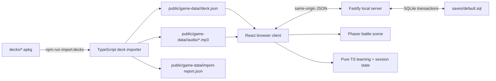
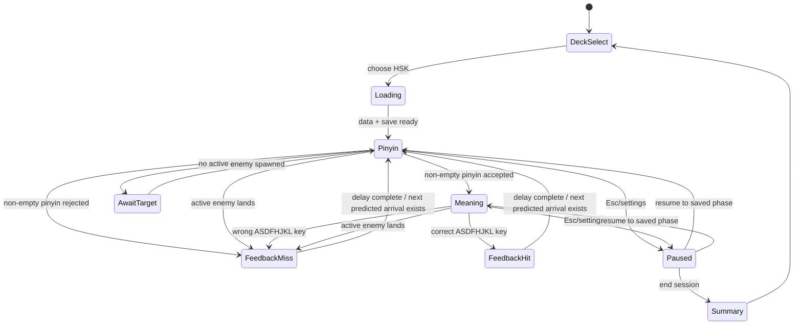
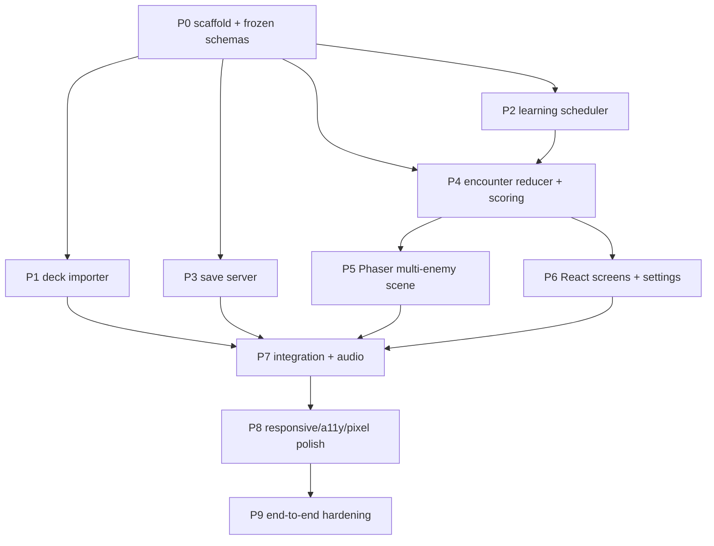

# Ziduoduo — main execution plan

**Status:** Battle Mode is the active implementation; retired Learn/Review planning remains below only as historical context
**Product:** Ziduoduo (字多多) — a local-first TypeScript web game that turns HSK vocabulary into descending words  
**Source decks:** the six `.apkg` files in [`../decks/`](../decks/README.md)

The Battle status blocks and runtime topology describe the active contract.
Unmarked Learn/Review release-planning details below are retired historical
context and are not implementation authority. Supporting details live in:

- [`GAMEPLAY.md`](GAMEPLAY.md) — encounter rules, multi-enemy targeting, scoring, and settings
- [`DATA_PIPELINE.md`](DATA_PIPELINE.md) — Anki import, normalization, indexes, audio, and source audit
- [`LEARNING_AND_SAVES.md`](LEARNING_AND_SAVES.md) — single-card FSRS memory, Learn sessions, acquisition log, and local save schema (v4)
- [`UI_SPEC.md`](UI_SPEC.md) — screens, responsive behavior, controls, visual tokens, and accessibility
- [`TEST_PLAN.md`](TEST_PLAN.md) — unit, integration, browser, importer, and statistical tests
- [`AGENT_WORK.md`](AGENT_WORK.md) — small-agent work packages, dependencies, ownership, and handoff rules

## 1. Product contract

### Core loop

> **Status update (battle-first rework):** steps 1–8 below describe the
> retired Learn-first flow. The implemented primary flow is: the title
> screen offers **Battle Mode first** (enabled at zero vocabulary; the first
> launch seeds curriculum positions 1..5 at mastery 0), an **endless
> battle** whose every spawn is a live weighted draw from the vocabulary's
> mastery categories (Hill curve `r = n^1.3/(n^1.3+5^1.3)`; low share
> `1 − 0.9r`; developing:mastered .50:.40; uniform within category;
> active/preparing words excluded), mastery moves ±10 per clean
> correct/miss and drives enemy pressure (`mastery/100`), sessions end only
> manually and keep a summary, and progress persists per-outcome to a
> server-side SQLite `saves/default.sql` (vocab + settings tables) through
> the four REST endpoints in `src/shared/battle.ts`. The Writing/Learn
> workflow (steps 2–5) and the Re-Learn workflow remain implemented
> internally but are disabled/hidden in the UI.

1. The player selects exactly one HSK grade (HSK 1–6). Grades are never locked. **A grade click launches Learn Mode — never a battle.**
2. Learn Mode creates (or resumes) a session: every currently due introduced word of the grade plus up to the configured number of new curriculum words, presented one card at a time.
3. Each card keeps pinyin and meaning visible, auto-plays local word audio, and is completed by guided stroke-order writing on a single large tian-zi square; a first presentation loops the stroke-order demo, later ones offer Show Demo.
4. After writing, the player sees the elapsed writing time and rates the card **Again / Hard / Good / Easy**; each choice displays its computed next interval before selection. FSRS applies the rating to the word's single card and progress checkpoints atomically.
5. A word leaves the session when its card reaches the FSRS review state; the earliest due remaining card is always served next (Anki-style learn-ahead). The session ends when every word has passed. A word enters the ordered `acquired_words` table exactly once, at its first review-state rating.
6. At least 20 acquired words unlock the cross-grade **Review arcade**. Its deterministic base plan is drawn from the `acquired_words` recency log alone; at 100+ words it uses `reviewSessionLength` spawns (200–500), the newest 20 words twice, ranks 20–99 once, and Old fillers. For 20–99 words, tier boundaries, recency pressure, and game length scale proportionally to the pool size. Delayed additive retries continue until every missed-word obligation is cleared by a clean correct answer. Review answers never mutate FSRS state, and a finished summary can hand its most-missed words to the **Re-Learn session**.
7. Progress is checkpointed to a file under gitignored `saves/` after every rating. The player may leave a Learn session at any time; clicking the grade resumes it exactly. Review sessions are deliberately not resumable; the single cross-grade Re-Learn session is.
8. A grade's milestone (`firstCompletedAt`) is permanent once every word's card has reached review.

### Settings added to the contract

- A settings screen adjusts **enemy spawn rate** and one **global enemy speed**.
- The global setting multiplies every active and future enemy's mastery-derived speed uniformly; per-enemy random speeds are out of scope.
- A new target is chosen by shortest predicted time to ground, then locked until removal or landing. New spawns cannot steal the lock.
- Opening settings pauses the simulation. Applying a global speed change updates all active enemies uniformly. Applying a spawn-rate change starts a fresh interval rather than causing a burst.

### Explicit MVP decisions

| Topic | Decision |
|---|---|
| Application shape | Local Node server plus browser client; a static-only app cannot write repository-local save files. |
| Deck scope | One merged HSK 1–6 Battle corpus keyed by the insertion-ordered curriculum card IDs; duplicate IDs keep their earliest deck occurrence. |
| Enemy population | Multiple simultaneous enemies; maximum 32 active as a rendering safety ceiling. |
| Targeting | Shortest predicted time to ground, then lowest `spawnOrdinal` as tie-breaker. Lock until resolution; no spawn-time or manual switching. |
| Wrong answer | One scored/mastery outcome per enemy. A wrong non-empty pinyin or wrong meaning key removes the enemy and opens a blocking correction panel; descent and spawning resume only after **Continue**. |
| Blank/irrelevant input | Blank Enter and keys outside the current phase are ignored, not counted wrong. |
| Audio timing | Play word audio after pinyin succeeds, before the meaning choice; **R** replays it in the meaning phase. Play a blaster on a complete correct answer and a buzzer on wrong answers or natural landings. |
| Persistence | Authoritative server-side SQLite `saves/default.sql` (vocab + settings tables) behind the four REST endpoints in `src/shared/battle.ts`; battle tuning lives in `config/battle.yaml`. |
| Completion | Battle is endless and ends only when the player chooses **End Battle**; there is no automatic completion state. |
| Source duplicates | Exact semantic duplicates become one logical word with multiple source GUIDs; distinct senses remain distinct. |
| Learning set | The active pool contains all vocab rows above mastery 50 plus the five lowest-position rows at or below 50; graduation refills low slots from the next unseen curriculum IDs in strict order. |
| Offline behavior | Generated decks and a reachable local save server are required; there is no offline progress or demo fallback. Runtime assets require no CDN. |

## 2. Reference experience

The PNGs are visual acceptance references rather than exact pixel-coordinate mandates. Implementations should match their hierarchy, palette, density, and state clarity. Their CJK glyphs are intentionally rendered at full output resolution over the low-resolution pixel-art layer; implementation agents must preserve that mixed-resolution treatment.

| State | Reference |
|---|---|
| Deck selection and progress | [`01-deck-select.png`](01-deck-select.png) |
| Multiple enemies; nearest target; pinyin entry | [`02-battle-pinyin.png`](02-battle-pinyin.png) |
| Pinyin confirmed, audio played, eight-key meaning grid | [`03-battle-meaning.png`](03-battle-meaning.png) |
| Wrong answer or landing feedback | [`04-miss-feedback.png`](04-miss-feedback.png) |
| End-session report and persisted progress | [`05-session-summary.png`](05-session-summary.png) |
| Spawn-rate and global-speed settings | [`06-settings.png`](06-settings.png) |
| Mobile/touch meaning selection | [`07-mobile-meaning.png`](07-mobile-meaning.png) |

Mockups can be regenerated with `python3 designs/render_mockups.py` (design tooling only; Pillow is not a runtime dependency).

## 3. Technical architecture

### Chosen stack

- **Language:** TypeScript in strict mode for client, domain, importer, tests, and server
- **Client shell:** React + Vite
- **Game rendering:** Phaser 3, configured for nearest-neighbour/pixel rendering
- **Cross-boundary state:** a small Zustand store that exposes immutable snapshots; learning and simulation logic remain framework-free
- **Server:** Fastify, bound to `100.65.64.80` by default
- **Validation/contracts:** Zod schemas shared between importer, server, and client
- **Anki importer:** Node/TypeScript, streaming ZIP reader plus SQLite reader
- **Tests:** Vitest for pure/integration tests and Playwright for browser flows
- **Package manager:** npm with a committed lockfile

Phaser owns moving world objects, effects, and fixed-step simulation. React owns text input, meaning buttons, menus, settings, status, and accessibility. Hanzi and critical answer text remain DOM-visible in the command panel even though the same Hanzi is rendered on the canvas enemy.

### Runtime topology



Development runs Vite and Fastify concurrently, with `/api` proxied to Fastify. Production build output is served by Fastify so save calls remain same-origin.

### Dependency direction

```text
React UI ───────┐
                ├──> application/session coordinator ──> pure domain modules
Phaser scene ───┘                                      ├── learning scheduler
                                                       ├── encounter reducer
                                                       ├── scoring
                                                       └── shared schemas

Fastify routes ──> save repository ──> filesystem
Importer ────────> shared deck schemas (never imports client or server code)
```

Rules:

1. `src/domain/` imports no React, Phaser, browser, Fastify, or filesystem APIs.
2. Phaser does not decide learning outcomes or modify mastery directly; it emits typed events.
3. React does not calculate enemy positions; it reads a view snapshot.
4. The server validates every save payload and owns atomic file replacement.
5. Generated game data is disposable and reproducible from `decks/*.apkg`.

## 4. Target repository shape

```text
.
├── decks/                         # immutable .apkg source packages + checksums
├── designs/                       # this plan and PNG references
├── public/
│   ├── fonts/                     # bundled pixel Latin + readable CJK fonts
│   └── game-data/                 # generated, gitignored runtime JSON/audio
├── saves/                         # local save files, entirely gitignored
├── src/
│   ├── client/
│   │   ├── app/                   # routes/screens and composition
│   │   ├── components/            # HUD, command panel, choices, dialogs
│   │   ├── game/                  # Phaser config, BattleScene, sprites/effects
│   │   ├── state/                 # application coordinator and Zustand adapter
│   │   └── styles/                # tokens, layout, reduced-motion rules
│   ├── domain/
│   │   ├── deck/                  # runtime deck contracts and pinyin matching
│   │   ├── learning/              # weights, cooldowns, weighted selection
│   │   ├── session/               # encounter state machine and scoring
│   │   └── random/                # seeded PRNG and truncated Gaussian
│   ├── server/
│   │   ├── routes/                # health/save endpoints
│   │   ├── saves/                 # validation and atomic repository
│   │   └── index.ts
│   └── shared/                    # API schemas and cross-process constants
├── tools/
│   └── import-decks/              # APKG parser, normalizers, report, overrides
├── tests/
│   ├── fixtures/                  # tiny legal synthetic APKG/save fixtures
│   ├── integration/
│   └── e2e/
├── package.json
├── tsconfig*.json
└── vite.config.ts
```

Do not commit `public/game-data/` or `saves/`. Do commit importer reports generated in CI only if a later decision wants audit history; the source packages and `decks/SHA256SUMS` are currently the durable inputs.

## 5. Core state and event model

### Session state machine



World spawning and descent continue during `Pinyin`, `Meaning`, hit feedback, and natural-landing feedback. They freeze in `Paused`, settings, and wrong-answer review. Wrong-answer review remains visible until **Continue** is pressed; response timing and the spawn interval restart on dismissal so review time cannot penalize the player or cause a spawn burst.

The active target is a lock. Keep it while that enemy remains descending; only then choose a replacement:

```ts
activeEnemy = enemies.find(enemy => enemy.id === lockedTargetId)
  ?? enemies
    .filter(enemy => enemy.status === "descending")
    .sort((a, b) => timeToGround(a) - timeToGround(b) || a.spawnOrdinal - b.spawnOrdinal)[0]
```

Each enemy uses `pixelsPerSecond = BASE_SPEED * settings.enemySpeedMultiplier * wordSpeedMultiplier`. `wordSpeedMultiplier` scales linearly from `0.65` at mastery `1` to `1.50` at mastery `100`. A settings change still applies one uniform global factor.

### Event boundary

Representative domain events:

```ts
type SessionEvent =
  | { type: "enemySpawned"; enemyId: string; wordId: string; spawnOrdinal: number }
  | { type: "targetActivated"; enemyId: string; atMs: number }
  | { type: "pinyinSubmitted"; enemyId: string; raw: string; atMs: number }
  | { type: "meaningSelected"; enemyId: string; key: ChoiceKey; atMs: number }
  | { type: "enemyLanded"; enemyId: string; atMs: number }
  | { type: "feedbackFinished"; enemyId: string }
  | { type: "settingsApplied"; settings: DifficultySettings }
  | { type: "sessionEnded"; atMs: number };
```

A reducer returns commands such as `playWordAudio`, `destroyEnemy`, `breachEnemy`, `checkpointSave`, or `showSummary`. Side effects execute outside the reducer. Duplicate landing/submission events for an already resolved enemy are ignored by enemy ID, ensuring exactly one learning update.

## 6. Data and persistence boundaries

### Build-time deck compilation

The browser never reads SQLite or `.apkg`. `npm run import:decks`:

1. verifies each package against `decks/SHA256SUMS` when a hash is present;
2. streams out `collection.anki21`, `media`, and the 5,401 referenced word-audio entries;
3. converts source notes into versioned `RuntimeDeck` JSON;
4. applies Unicode, HTML, pinyin, sense-label, and exact-duplicate normalization;
5. precomputes meaning pools and reverse indexes;
6. copies only word audio under safe content-derived filenames;
7. emits a blocking validation report.

See [`DATA_PIPELINE.md`](DATA_PIPELINE.md) for exact schemas and known source anomalies.

### Save files

Browser sandboxing makes a repository-local Node API mandatory. Battle progress
is stored in server-side SQLite at `saves/default.sql`: the five-column `vocab`
table and separate `settings` table are accessed through the four REST
endpoints in `src/shared/battle.ts`. Each resolved encounter writes its mastery
outcome transactionally; Battle has no persisted finite plan or scheduler RNG.
Fresh saves only are supported, with no migration or fallback path.

## 7. Quality gates

An implementation is not feature-complete until all gates pass.

### Gate A — source data

- All six source archives pass checksum and ZIP tests.
- Import count matches the documented source count before deduplication.
- Every emitted logical word has non-empty Hanzi, at least one accepted pinyin form, a meaning, and a resolvable word-audio asset.
- Meaning generation can produce eight unique labels for every word and never includes another sense of the same displayed Hanzi as a distractor.
- Import output is byte-for-byte deterministic for the same inputs and importer version.

### Gate B — live Battle selection and mastery

- The active pool contains exactly the five lowest-position vocab rows at mastery 0..50 plus every row above 50.
- Every spawn is a live category draw using the configured Hill shares, followed by a uniform draw within that category; empty categories renormalize and active/preparing words are excluded.
- A clean correct outcome adds 10 mastery; a wrong pinyin, wrong meaning, reveal, or landing subtracts 10, clamped to 0..100.
- One enemy produces at most one mastery outcome.
- Graduating a low-slot word above 50 appends the next unseen curriculum row in strict order until five low slots are restored.
- `time_mastered` is set the first time mastery reaches 100 and is never cleared by later regression.

### Gate C — game behavior

- At least two enemies can be visible simultaneously under default settings.
- Active enemies move at their deterministic mastery-derived speeds multiplied by the same global setting.
- The locked predicted-soonest arrival is highlighted and is the only word accepted by the command panel.
- Removing/landing the target immediately locks the remaining enemy predicted to land soonest.
- A target at ground level cannot land until its active pinyin recall window expires; altitude before selection never shortens that window, and accepted pinyin disables landing during meaning selection.
- Spawn and speed sliders work, persist, and do not create a spawn burst.
- Wrong answer and natural landing both reset streak; neither ends the game.

### Gate D — persistence

- Refresh after a resolved answer loads the same vocab mastery and settings from `saves/default.sql`.
- SQLite writes are transactional and schema validated; incompatible schemas fail visibly rather than being migrated or replaced.
- Each resolved encounter is persisted through the outcome endpoint; failed requests surface a clear error.
- `saves/` and generated runtime deck assets remain ignored by Git.

### Gate E — UX and accessibility

- Desktop gameplay is fully usable from the keyboard.
- Touch controls expose all eight choices and a mobile pinyin keyboard path.
- Canvas information required to answer is duplicated in accessible DOM.
- Correctness is never conveyed by color alone.
- Reduced-motion mode replaces shake/flashes with static state changes.
- At 360×640 and 1440×900, controls do not overlap the battlefield or clip meanings.

## 8. Execution sequence

Use the detailed task contracts in [`AGENT_WORK.md`](AGENT_WORK.md). The safe dependency order is:



P1, P2, and P3 may run in parallel only after P0 freezes shared contracts. P5 and P6 may run in parallel after the encounter event API is stable. Each package must arrive with tests and a handoff note; agents should not casually edit another package's owned paths.

## 9. Definition of done

The first release is done when a fresh clone with source decks can run:

```text
npm ci
npm run import:decks
npm test
npm run build
npm start
```

and then, from the browser:

1. launch Battle from a fresh save and seed the first five curriculum words;
2. see a growing queue of mastery-speed-scaled descending Hanzi enemies;
3. answer the highlighted, locked predicted arrival with pinyin then one of eight meaning keys;
4. hear local word audio after correct pinyin;
5. change spawn rate and global speed from settings;
6. accumulate score/streak without a death state;
7. end voluntarily, see a report, and verify mastery progress in `saves/default.sql`;
8. resume with vocab mastery and settings intact;
9. graduate low-mastery slots and observe strictly ordered curriculum refill.
